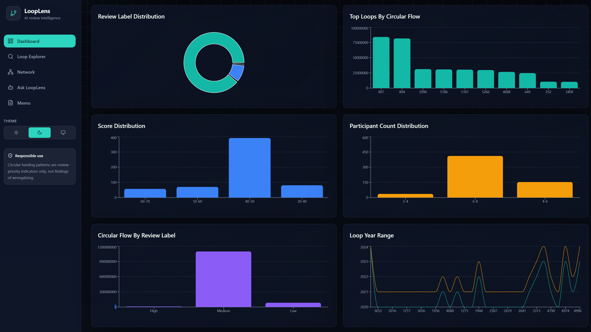
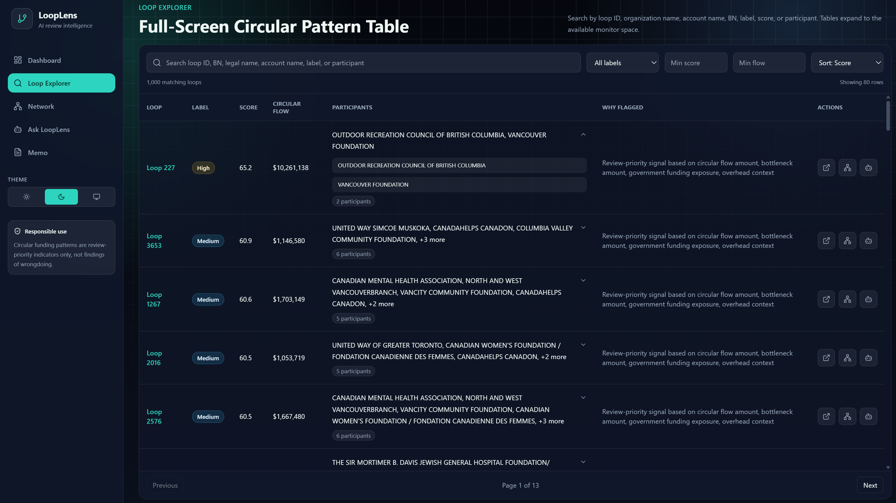
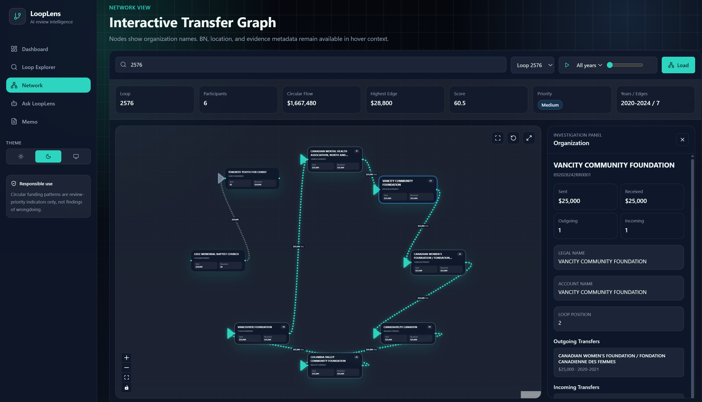
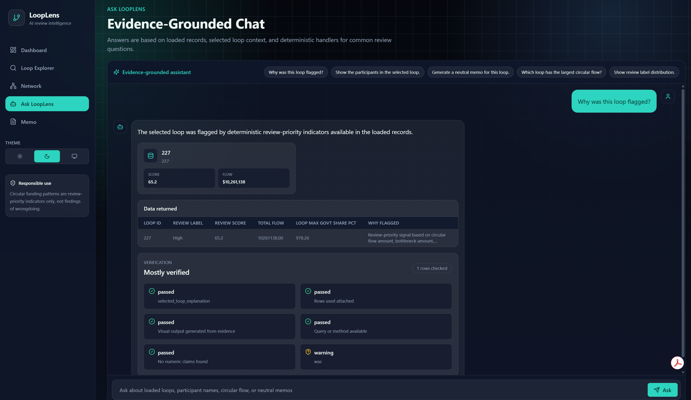
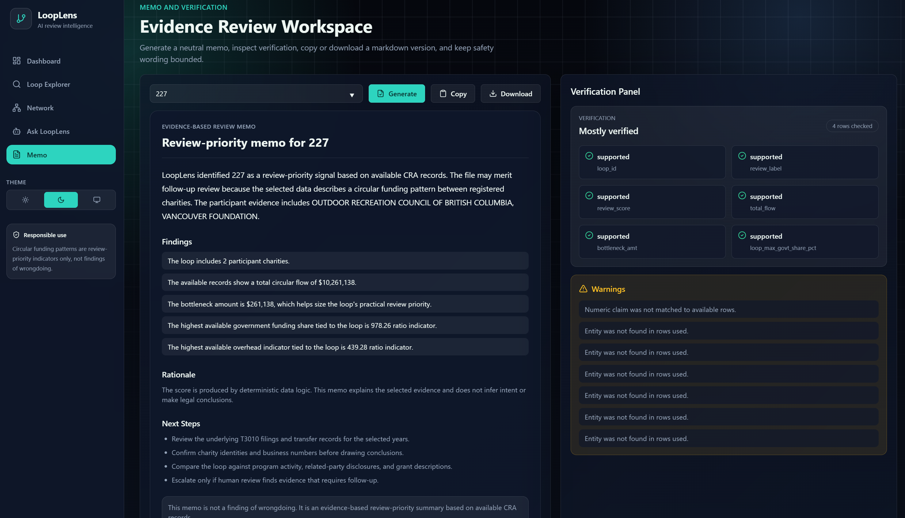

# LoopLens

<p align="center">
  
</p>

<p align="center">
  <strong>AI-assisted review of circular charity funding patterns</strong>
</p>

<p align="center">
  <a href="https://looplense.onrender.com/"><strong>Live Demo</strong></a>
  ·
  <a href="https://looplense.onrender.com/docs"><strong>API Docs</strong></a>
  ·
  <a href="https://luma.com/5e83iia8"><strong>Agency 2026 Ottawa</strong></a>
</p>

<p align="center">
  
  
  
  
</p>

---

## Live Demo

The full backend application is live here:

**https://looplense.onrender.com/**

API documentation:

**https://looplense.onrender.com/docs**

> Note: The app is hosted on Render's free tier, so the first request may take longer if the service has been inactive.

---

## Overview

**LoopLens** is an AI-assisted review platform for exploring circular funding patterns in Canadian charity-transfer data.

The system helps users inspect funding loops such as:

```text
Organization A -> Organization B -> Organization C -> Organization A
```

These circular patterns are **not automatically suspicious**. Many may be structurally normal, including denominational hierarchies, federated charity networks, umbrella organizations, grant redistribution structures, or donation platforms.

LoopLens does **not** make accusations. It helps reviewers understand the structure of a loop, inspect supporting evidence, visualize relationships, generate neutral review memos, and verify whether generated claims are supported by the available data.

---

## Built for Agency 2026 Ottawa

LoopLens was built for **Agency 2026 - Ottawa**, a national AI hackathon hosted by the **Government of Alberta** and focused on practical applications of AI in government delivery, transparency, accountability, and public-sector decision-making.

The project was developed for the **Funding Loops** challenge, which asked participants to use CRA T3010 charity data to identify circular funding patterns, including reciprocal gifts, triangular cycles, and longer chains where dollars leave an organization and eventually return to it.

Event page: **https://luma.com/5e83iia8**

---

## Problem

Public funding and charitable transfers can move through complex networks. In some cases, funding may travel in circular structures:

```text
Charity A gives to Charity B
Charity B gives to Charity C
Charity C gives back to Charity A
```

The challenge is not simply finding these loops. The harder challenge is helping reviewers understand:

- which organizations are involved,
- how money moved between them,
- when the transfers occurred,
- whether the pattern appears structurally normal,
- which loops may deserve closer human review, and
- what evidence supports any generated explanation.

LoopLens combines data processing, network visualization, AI-style review assistance, memo generation, and claim verification in one interface.

---

## What LoopLens Does

LoopLens helps users:

- detect circular funding patterns,
- identify the organizations involved in each loop,
- inspect transfer relationships between participants,
- visualize loops as interactive networks,
- rank loops by review priority,
- generate neutral review memos,
- ask natural-language questions about the data,
- verify whether generated claims are supported, and
- explore charts, tables, and high-priority patterns.

---

## Screenshots

Add your screenshots inside an `assets/` folder using the filenames below.

### Dashboard

<p align="center">
  
</p>

### Loop Explorer

<p align="center">
  
</p>

### Network View

<p align="center">
  
</p>

### Ask LoopLens

<p align="center">
  
</p>

### Memo and Verification Workspace

<p align="center">
  
</p>

---

## Main Features

### Modern AI Review Dashboard

The dashboard provides a high-level view of review-priority patterns and funding-loop metrics.

It includes:

- animated metric cards,
- review label distribution,
- circular flow summaries,
- top loops by score and flow,
- charts for quick exploration, and
- live backend-powered data loading.

### Loop Explorer

The Loop Explorer provides a full-screen responsive table for exploring circular patterns.

Users can:

- search by loop ID,
- search by organization name,
- search by BN / registration number,
- filter by review label,
- sort by score, circular flow, and participant count,
- open detailed loop views, and
- jump directly to network visualization.

### Advanced Network Visualization

The Network View turns circular funding patterns into an interactive graph.

It supports:

- organization nodes,
- directional transfer edges,
- transfer amounts,
- year ranges,
- circular-path highlighting,
- zoom and pan controls,
- node and edge inspection,
- organization names and BN metadata, and
- animated investigation-style graph views.

### Ask LoopLens

LoopLens includes a chat-style interface for asking questions about the loaded data.

Example questions:

```text
Why was this loop flagged?
Which organizations are involved in this loop?
Which loop has the largest circular flow?
Show the highest-priority circular patterns.
Generate a neutral review memo for this loop.
```

The chatbot is designed to answer based on available project data and supporting evidence.

### Memo Generator

LoopLens can generate neutral review memos for selected loops.

The memo generator focuses on:

- organizations involved,
- transfer relationships,
- available evidence,
- review-priority rationale,
- careful wording, and
- human-review recommendations.

### Verification Layer

The verification module checks generated outputs for:

- unsupported claims,
- risky wording,
- overstated conclusions,
- missing evidence, and
- claim-level support status.

This helps keep AI-generated summaries cautious, transparent, and review-focused.

---

## Responsible Use

LoopLens is a review-support prototype. It does **not** determine fraud, misconduct, corruption, or wrongdoing.

A high review-priority score means only that a pattern may deserve closer human review based on the available data. It is not a legal, financial, investigative, or compliance conclusion.

Recommended language:

```text
review priority
pattern requiring human review
circular funding pattern
available records suggest
evidence-based summary
not a finding of wrongdoing
```

Avoid unsupported language such as:

```text
fraud
corruption
money laundering
guilty
criminal
scam
fake charity
```

---

## Tech Stack

### Frontend

- Next.js
- React
- TypeScript
- Tailwind CSS
- Modern animated UI components
- Interactive charts
- Advanced network visualization
- Dark/light mode support

### Backend

- FastAPI
- Python
- JSONL data processing
- CRA T3010-derived processed data
- Evidence-grounded query logic
- Memo generation
- Claim verification
- Chat and review-support services

### Deployment

- Render Web Service
- One-service deployment
- FastAPI serves both:
  - `/api/*` backend routes
  - exported Next.js frontend from `frontend/out`

---

## Project Structure

```text
LoopLense/
|
|-- backend/
|   |-- main.py
|   |-- api/
|   |-- services/
|   `-- schemas.py
|
|-- frontend/
|   |-- app/
|   |-- components/
|   |-- lib/
|   |-- public/
|   `-- package.json
|
|-- src/
|   |-- load.py
|   |-- query.py
|   |-- score.py
|   |-- graph.py
|   |-- memo.py
|   |-- verify.py
|   `-- chat.py
|
|-- cra/
|   |-- loops.jsonl
|   |-- loop_participants.jsonl
|   |-- loop_edges.jsonl
|   `-- identification_name_history.jsonl
|
|-- scripts/
|   `-- build_render.sh
|
|-- requirements.txt
|-- render.yaml
`-- README.md
```

---

## Local Development

### 1. Clone the repository

```bash
git clone https://github.com/matthew-rocky/LoopLense.git
cd LoopLense
```

### 2. Install Python dependencies

```bash
pip install -r requirements.txt
```

### 3. Install frontend dependencies

```bash
cd frontend
npm install
cd ..
```

### 4. Build the frontend

```bash
cd frontend
npm run build
cd ..
```

### 5. Start the full app

```bash
python -m uvicorn backend.main:app --reload
```

Open:

```text
http://127.0.0.1:8000/
```

API docs:

```text
http://127.0.0.1:8000/docs
```

---

## Render Deployment

This project is deployed as a single Render Web Service.

### Build Command

```bash
pip install -r requirements.txt && bash scripts/build_render.sh
```

### Start Command

```bash
python -m uvicorn backend.main:app --host 0.0.0.0 --port $PORT
```

### Public URLs

App:

```text
https://looplense.onrender.com/
```

API Docs:

```text
https://looplense.onrender.com/docs
```

---

## Dataset Notes

LoopLens uses processed CRA charity-transfer data for circular funding analysis.

The repository includes only the smaller files required for the demo/runtime experience. Large raw CRA files are intentionally excluded from Git tracking to keep the repository lightweight and compatible with GitHub file-size limits.

Included demo/runtime files may include:

```text
cra/loops.jsonl
cra/loop_participants.jsonl
cra/loop_edges.jsonl
cra/identification_name_history.jsonl
```

Large raw files are kept out of the repository using `.gitignore`.

---

## Example Workflow

1. Open the live demo.
2. Review the dashboard summary.
3. Go to the Loop Explorer.
4. Select a loop with multiple participants.
5. Open the Network View.
6. Inspect organizations, transfer edges, years, and amounts.
7. Ask LoopLens a question about the selected loop.
8. Generate a neutral memo.
9. Run verification to check claim support.

---

## Team and Event Context

LoopLens was developed as a hackathon prototype exploring how AI systems can support public-interest review workflows.

The project reflects Agency 2026 Ottawa's broader goal of using AI, data science, and interactive tools to improve transparency, insight, and accountability in government-related spending and public-sector decision-making.

---

## Author

**Matthew Rocky**  
M.S. Systems Science & Engineering, Interdisciplinary AI  
University of Ottawa

LinkedIn: https://www.linkedin.com/in/matthew-rocky/  
GitHub: https://github.com/matthew-rocky


**Ayesha Khalil**

LinkedIn: https://www.linkedin.com/in/ayeshakhalil/


**Kenneth J. Preston**

LinkedIn: https://www.linkedin.com/in/kennethjpreston/


**Daniel Demoz**

LinkedIn: https://www.linkedin.com/in/daniel-s-demoz/


---

## Disclaimer

This project is a prototype for educational, portfolio, and demonstration purposes.

LoopLens does not make legal, financial, investigative, or compliance determinations. All outputs should be interpreted as review-support signals that require human judgment and additional verification.

---

## License

This project is intended for educational and portfolio demonstration purposes.

